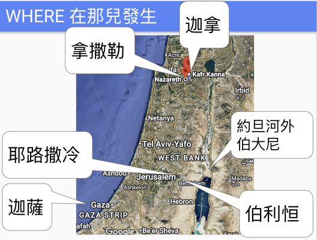
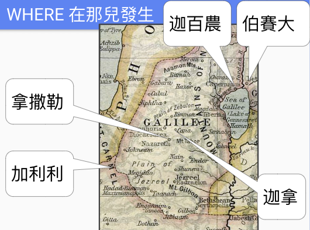
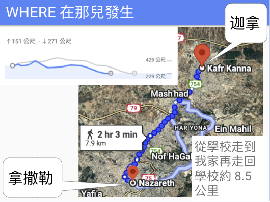

# 約翰福音再思

## MIGA
2024-10-3

昨晚新宇在學生團契帶約翰福音第一章中間一段施洗約翰見証的起首，查到猶太人去找施洗約翰時其實己有預設想要的答案 - 彌賽亞，以利亞，或那先知 。基本上就是期盼被問的 施洗約翰 是一個由信仰出發能復興以色列國的政治人物，但施洗約翰簡單回答 - "我不是" 三次。

用今日的術語想想，其實他們那些人想要的 不就是要 MIGA Make Isreal Great Again 嗎？ 

妄想用上帝及信仰的手段逹成政治目的去解決他們的生活 問題的人，從古到今都有，教會中最多。

不過，那並不是上帝為我們選的路。

彌賽亞的路是神羔羊代死贖罪的路

是上祭壇被大切八塊 燒掉的路

那才是唯一的道路 唯一的拯救

## 約翰福音第一章在說什麼？ "看"！
2024-10-22

"看"或"見"這二個字在約翰福音第一章中出現很多次
```
約 1:14 道成了肉身，住在我們中間，充充滿滿地有恩典有真理。我們也見過他的榮光，正是父獨生子的榮光。
約 1:18 從來沒有人看見神，只有在父懷裡的獨生子將他表明出來。
約 1:29 次日，約翰看見耶穌來到他那裡，就說：「看哪，神的羔羊，除去世人罪孽的！
約 1:32 約翰又作見證說：「我曾看見聖靈，彷彿鴿子從天降下，住在他的身上。
約 1:33 我先前不認識他，只是那差我來用水施洗的、對我說：『你看見聖靈降下來，住在誰的身上，誰就是用聖靈施洗的。』
約 1:34 我看見了，就證明這是神的兒子。」
約 1:36 他見耶穌行走，就說：「看哪，這是神的羔羊！」
約 1:38 耶穌轉過身來，看見他們跟著，就問他們說：「你們要甚麼？」他們說：「拉比，在哪裡住？」
約 1:39 耶穌說：「你們來看。」他們就去看他在哪裡住，這一天便與他同住；那時約有申正了。
約 1:41 他先找著自己的哥哥西門，對他說：「我們遇見彌賽亞了。
約 1:42 於是領他去見耶穌。耶穌看見他，說：「你是約翰的兒子西門，你要稱為磯法。」
約 1:45 腓力找著拿但業，對他說：「摩西在律法上所寫的和眾先知所記的那一位，我們遇見了，就是約瑟的兒子拿撒勒人耶穌。」
約 1:46 拿但業對他說：「拿撒勒還能出甚麼好的嗎？」腓力說：「你來看！」
約 1:47 耶穌看見拿但業來，就指著他說：「看哪，這是個真以色列人，他心裡是沒有詭詐的。」
約 1:48 拿但業對耶穌說：「你從哪裡知道我呢？」耶穌回答說：「腓力還沒有招呼你，你在無花果樹底下，我就看見你了。」
約 1:50 耶穌對他說：「因為我說『在無花果樹底下看見你』，你就信嗎？你將要看見比這更大的事」；
約 1:51 又說：「我實實在在地告訴你們，你們將要看見天開了，神的使者上去下來在人子身上。」
```
也就是說，約翰在第一章是在邀請我們來看神，如何看神，籍由道成肉身的耶穌看神。
```
邀請我們來看父獨生子的榮光
邀請我們來看父懷裡的獨生子表明出來的神
邀請我們來看除去世人罪孽的神的羔羊
邀請我們來看聖靈彷彿鴿子從天降下住在耶穌的身上
邀請我們來看施洗約翰的証詞
邀請我們來看施洗約翰口中的神的兒子
邀請我們來看行走的耶穌
```
```
「你們來看。」
「你來看！」
```
```
邀請我們來看耶穌在哪裡住
邀請我們來看彌賽亞
邀請我們來看可以對話的耶穌
邀請我們來看摩西在律法上所寫的和眾先知所記的那一位
邀請我們來看腓力遇見的那一位
邀請我們來看約瑟的兒子拿撒勒人耶穌
邀請我們來看早己看到了我們的耶穌
邀請我們來看比耶穌說『在無花果樹底下看見你』更大的事
邀請我們來看天開了
邀請我們來看神的使者上去下來在人子身上
```
```
「你們來看。」
「你來看！」
```

然後，他（第二章）直接走去你家給你看！
## 約翰福音第一章結束時，那五位門徒信耶穌了嗎？ 没有！
2024-10-19

約翰福音第一章中提到了施洗約翰去看耶穌的二個門徒，其中一名是安得烈，加上他的兄弟西門彼得，和他們同城的腓力，加上拿但業跟從了耶穌，那時，他們五人信了耶穌嗎了？

從約翰的筆下來看，其實是沒有。(從何可看出？)
* 何謂看耶穌？
* 何謂跟從耶穌？
* 何謂信耶穌？
* 信耶穌有不同的信嗎？

約2:11	這是耶穌所行的頭一件神蹟，是在加利利的迦拿行的，顯出他的榮耀來；他的門徒就信他了。

也就是說，耶穌是在迦拿的婚宴上行了神蹟後，"他的門徒就信他了"，換句話說，之前尚未囉！

那没信也跟著耶穌？

信是一個過程，而不是一個刹那！

## 迦拿的重要性 - 拿但業的家鄉
2024-10-21

本文為2024年查考約翰福音中的一些再思

今天才發現約翰福音第一章最後不應和第二章迦拿婚宴分開來看。分開讀就錯失了一件重要的事！

拿但業是迦拿人！！！

約 21:2 ...並加利利的迦拿人拿但業...

約 1:45-51 腓力找著拿但業，對他說：「摩西在律法上所寫的和眾先知所記的那一位，我們遇見了，就是約瑟的兒子拿撒勒人耶穌。」 46 拿但業對他說：「拿撒勒還能出甚麼好的嗎？」腓力說：「你來看！」 47 耶穌看見拿但業來，就指著他說：「看哪，這是個真以色列人，他心裡是沒有詭詐的。」 48 拿但業對耶穌說：「你從哪裡知道我呢？」耶穌回答說：「腓力還沒有招呼你，你在無花果樹底下，我就看見你了。」 49 拿但業說：「拉比，你是　神的兒子，你是以色列的王！」 50 耶穌對他說：「因為我說『在無花果樹底下看見你』，你就信嗎？你將要看見比這更大的事」； 51 又說：「我實實在在地告訴你們，你們將要看見天開了，　神的使者上去下來在人子身上。」2:1 第三日，在加利利的迦拿有娶親的筵席，耶穌的母親在那裡。耶穌和他的門徒也被請去赴席。...(變水為酒)... 2:11 這是耶穌所行的頭一件神蹟，是在加利利的迦拿行的，顯出他的榮耀來；他的門徒就信他了。

```
你問我家鄉能出甚麼好的
我就去你家鄉給你看能出甚麼好的
將要看見什麼更大的事？
在你家隔壁變水為酒給你喝
看看那六口大石缸
以前你常會經過的鄰居家的六口大石缸
你從小到大曾喝過水的六口大石缸
道具是貴鄉的喔
你家隔壁的喔！
助手是你們的人喔
我照樣變
是在你家鄉變的喔！
喝了這你才真會信
你爸媽叔伯姨舅婆公堂表哥嫂姐妹弟全喝過了我變出來的酒
你來跟從我夠實在唄
還會懷疑拿撒勒能出什麼好的嗎？
```

## 拿但業看不起誰？他看不起自己！
2024-10-22

約翰1:45-46 腓力找著拿但業，對他說：「摩西在律法上所寫的和眾先知所記的那一位，我們遇見了，就是約瑟的兒子拿撒勒人耶穌。」拿但業對他說：「拿撒勒還能出甚麼好的嗎？」

以往讀這段聖經，總以為拿但業看不起耶穌是因為他對拿撒勒這地有歧視，這週詳細查考後，才發現不是，而是他看不起自己的出身。

要理解我為什麼這麼說，得先了解拿但業和拿撒勒的關係。

在整本聖經中，除了約翰福音第一章這段之外，只有另一處提到 拿但業，那就是 約 21:2 ... 並加利利的迦拿人拿但業... ，所以拿但業是加利利的迦拿人，是的，就是接下來耶穌第三日去參加婚宴的那個迦拿。

那迦拿在那兒呢？和拿撒勒的關係又如何呢？

調出地圖 Google Map 來看，迦拿位在拿撒勒東北方用今日的道路走約7.9公里可逹，用Google Map 估算 走路約要二小時，拿撒勒的位置，比迦拿在海拔上高個120公尺， 在 海拔229公尺和359公尺，都算是加利利山區中的村。二者的距離，基本上就是從 De Anza College 走到我家再走回去，但要往上下坡走一點，不是平的。



所以聖經中 拿但業說：「拿撒勒還能出甚麼好的嗎？」基本上就是說「我家隔壁村還能出甚麼好的嗎？」

或作今天在矽谷學生團契的同學來理解，就是 有一天一位 De Anza College 的同學和另一位同學說，「摩西在律法上所寫的和眾先知所記的那一位，我們遇見了，就是 Foothill College 的耶穌。」 而這位De Anza College 的同學 回答  「Foothill College 還能出甚麼好的嗎？」（又不是史丹佛，MIT，柏克萊 或UCLA，我們De Anza College和 Foothill College同一學區我還不知道麼？）

他不是看不起 拿撒勒人

他是看不起 迦拿附近的人，包括迦拿

他是看不起自己的出身- 迦拿，拿撒勒旁的迦拿

所以 約 1:48 拿但業對耶穌說：「你從哪裡知道我呢？」耶穌回答說：「腓力還沒有招呼你，你在無花果樹底下，我就看見你了。」
是什麼意思？

意思是耶穌住拿撒勒是拿但業鄰村的，二村相隔不遠，走二小時就到了，我娘和你們村熟的很，過二天我還要和她一起去你村上吃婚宴哩，以前我路過你村上時你没事在無花果樹底下閒晃時我早注意到你了，你在迦拿的㡳細我清楚的很，貴村大戶辦喜酒還要我娘幫著指揮用人哩，你們村那個人我不知道，你是不是詭詐的人風評早入我耳了！

拿但業看不起自己

因為他是拿撒勒旁加利利小村迦拿的人

但耶穌没有看不起他

因為早就注意他了

「看哪，這是個真以色列人，他心裡是沒有詭詐的。」

我是認識你的

遠遠的觀察你很久了

只是你不知道而己

